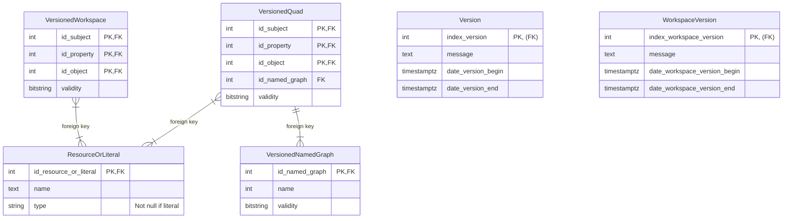
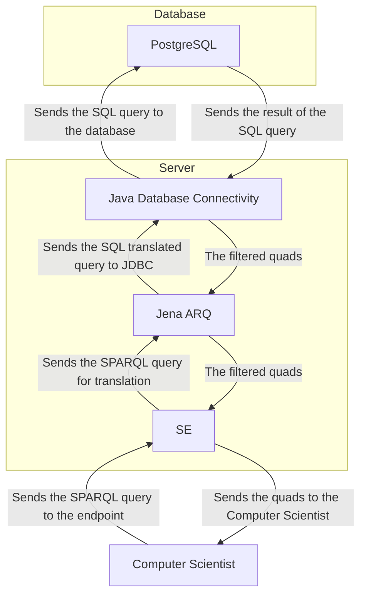
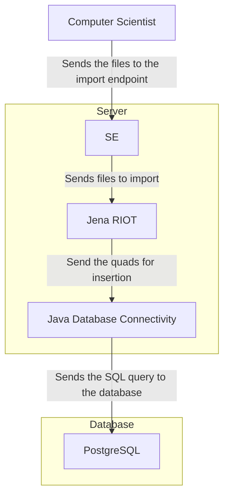
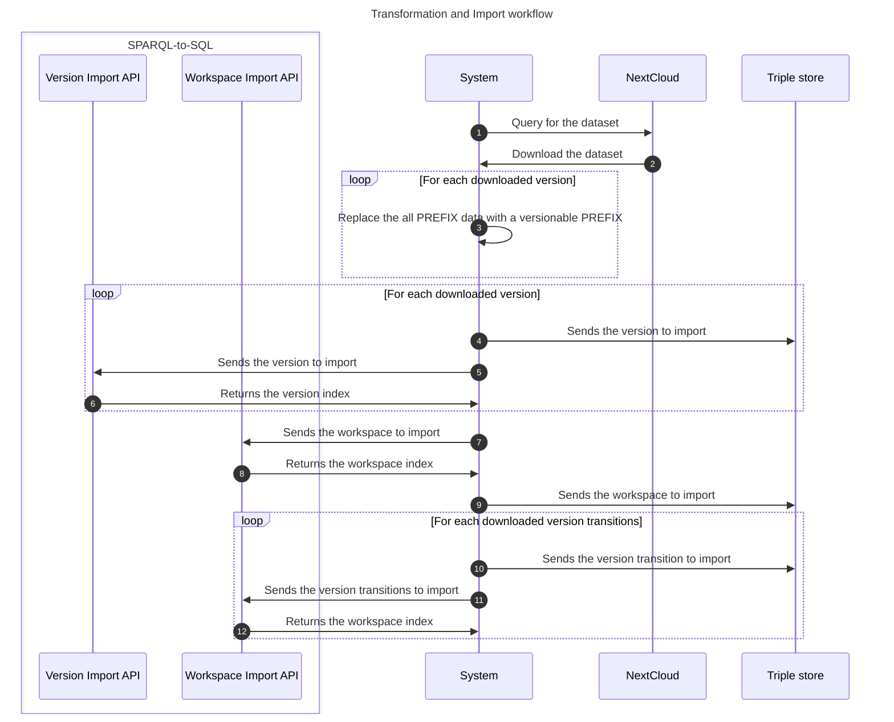

# SPARQL to SQL Project
This project aims to create a Java Spring parser that can convert SPARQL queries into SQL queries.
The project is part of the BD team's research efforts within the [LIRIS](https://liris.cnrs.fr/) and [VCity project](https://projet.liris.cnrs.fr/vcity/).
The aim of this POC is to query a set of city version and extract associated knowledge.

## Motivations
### Why create a "SPARQL-to-SQL" translator rather than a from scratch engine?
Our motivation is to find a method for *retrieving knowledge* from a *set of urban data versions* stored in *RDF format*.

Motivations for linking SPARQL and SQL are numerous, particularly in the fields of science, technology,
and business, where there is a growing need to integrate increasingly diverse data sources (captors, institutions, ...).
By using a SPARQL to SQL translator, we can enable relational databases to be exposed on the Semantic Web and queried with SPARQL *(with the same performance as with SQL?)*.
This allows researchers and developers to work with RDF and relational data seamlessly and efficiently while leveraging the performance optimizations of existing relational databases.

A *"from scratch"* engine that is not based on SPARQL nor SQL *would not be interoperable* with these query systems.
It is more simple than reimplementing the full stack (algebra, including join algorithms, optimisation, efficient storage and indexing)
and because we think that performance will be comparable to a dedicated implementation.

### Why this experiment?
We want to ensure the **provenance, accuracy, efficiency, and reliability** of querying a condensed representation of
the various version of a dataset with regard to querying each different version represented extensionally,
that is understanding whether our proposal of adding to each quad the set of versions it appears in,
instead of representing each version as a separate dataset, leads to a more efficient way of answering queries across versions.
A query-scenario of this experiment can be : *"Which city version has the highest number of trees in the district 1?"*

### Notes
Using a SQL as a backend for SPARQL has been done in some cases.
- **[A Mapping of SPARQL Onto Conventional SQL - W3C](https://www.w3.org/2008/07/MappingRules/StemMapping)**
  This paper discusses a semantics for expressing relational data as an RDF graph and an algebra for mapping SPARQL SELECT queries over that RDF to SQL queries over the original relational data.
  The goal is to provide a specification for SPARQL tool vendors and a foundation for the Semantic Web. It highlights the importance of creating a computable mapping from SPARQL semantics to SQL semantics.
- **[Evaluating SPARQL-to-SQL Translation in Ontop - Free University of Bozen-Bolzano](https://www.inf.unibz.it/~calvanese/papers/rodr-etal-ORE-2013.pdf)**
  This research paper discusses the importance of mapping relational databases into RDF using the R2RML standard.
  It mentions the research focused on translating SPARQL queries into SQL and evaluates the SPARQL-to-SQL translation in the Ontop system.
- **[RDF and SPARQL: Using Semantic Web Technology to Integrate the World's Data - W3C](https://www.w3.org/2007/03/VLDB/)**
  This resource explains how RDF and SPARQL can be used to improve access to relational databases. It discusses techniques for improving mappings between RDF and relational data and mentions that several query engines map SPARQL queries to relational queries,
  either by rewriting them into SQL queries or by compiling them directly into evaluation structures native to the database.

## Getting started
### Installation
This project uses Java 17 JDK + Maven and a [dockerized (make sure that Docker is installed too)](https://www.docker.com/) [PostgreSQL 15 database](https://www.postgresql.org/docs/15/index.html).
If you don't have Java 17 installed by default, I recommend that you install [SDKMAN!](https://sdkman.io/) and use this tool to set Java 17 as current session version.

> SDKMAN! is a tool for managing parallel versions of multiple Software Development Kits on most Unix based systems.

Once you have `SDKMAN!` installed, run:
```shell
sdk install java 17.0.7-amzn
sdk use java 17.0.7-amzn
```

Make sure you have Maven installed. If you don't have Maven installed, run: `sudo apt install maven`.

### Maven dependencies
This project uses:
- the `jena-arq 4.8.0` library for parsing SPARQL statements in Java,
- the `springdoc-openapi-starter-webmvc-ui 2.1.0` library to parse the Swagger API annotations and displays the [swagger-ui](http://localhost:8080/swagger-ui/index.html),
- a [Dockerized PostgreSQL 15 database](https://www.postgresql.org/docs/15/index.html), so the `postgresql` driver is installed too.

### Maven plugins
This project has been tested with:
- `sonarqube`, assuring the code quality,
- `JaCoCo`, testing the code coverage.

### Start the application
#### Dockerized database + Java Spring

```shell
# at the root of the project
# starts the database declared inside the docker-compose.yml file
docker compose up -d

# wait until the PostgreSQL database is up
# starts the Java Spring application locally (http://localhost:8080/)
mvn spring-boot:run 
```

### Implementation
#### Entity–Relationship model


#### Flowcharts
##### Query the relational database with a SPARQL query



##### Store RDF quads inside a relational database



### Testing
#### Swagger
The API description is available on the [swagger-ui](http://localhost:8080/swagger-ui/index.html) at runtime.

#### Tests 
```shell
# make sure your database is up

# starts the tests
mvn spring-boot:run test
```

#### Code quality and coverage
The code coverage and quality is available on the [Sonarqube server](http://localhost:9000) after running a sonar inspection.


### Sample data and workflow
This project has been tested with a dataset created by the [UD-Graph Project](https://github.com/VCityTeam/UD-Graph).
This dataset as been transformed to be compatible with the designed conceptual model.

