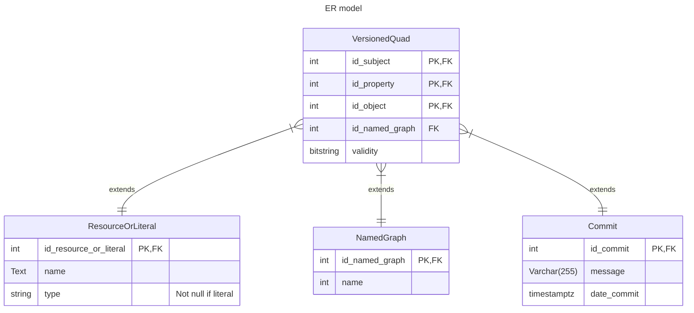
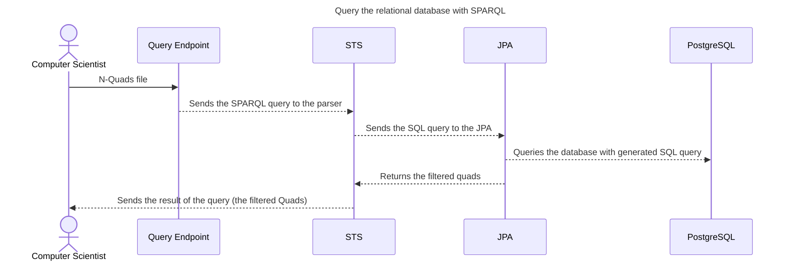
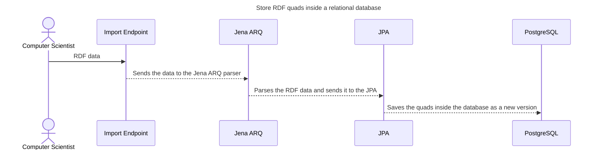

# SPARQL to SQL Project
This project aims to create a Java Spring parser that can convert SPARQL queries into SQL queries.
The project is part of the BD team's research efforts within the [LIRIS](https://liris.cnrs.fr/) and [VCity project](https://projet.liris.cnrs.fr/vcity/).
The aim of this POC is to query a set of city version and extract associated knowledge.

## Getting started
### Installation
This project uses Java 17 JDK + Maven and a [dockerized (make sure that Docker is installed too)](https://www.docker.com/) [PostgreSQL 15 database](https://www.postgresql.org/docs/15/index.html).
If you don't have Java 17 installed by default, I recommend that you install [SDKMAN!](https://sdkman.io/).

> SDKMAN! is a tool for managing parallel versions of multiple Software Development Kits on most Unix based systems.

Once you have `SDKMAN!` installed, run:
```shell
sdk install java 17.0.7-amzn
sdk use java 17.0.7-amzn
```

Make sure you have Maven installed. If you don't have Maven installed, run: `sudo apt install maven`.

### Maven dependencies
This project uses:
- the `jena-arq 4.8.0` library for parsing SPARQL statements in Java,
- the `springdoc-openapi-starter-webmvc-ui 2.1.0` library to parse the Swagger API annotations and displays the [swagger-ui](http://localhost:8080/swagger-ui/index.html),
- a [Dockerized PostgreSQL 15 database](https://www.postgresql.org/docs/15/index.html), so the `postgresql` driver is installed too.

### Start the application

```shell
# at the root of the project
# starts the database declared inside the docker-compose.yml file
docker compose up -d

# wait until the PostgreSQL database is up
# starts the Java Spring application locally (http://localhost:8080/)
mvn spring-boot:run 
```

### Implementation





### Testing
The API description is available on the [swagger-ui](http://localhost:8080/swagger-ui/index.html) at runtime.

```shell
# make sure your database is up

# starts the tests
mvn spring-boot:run test
```
