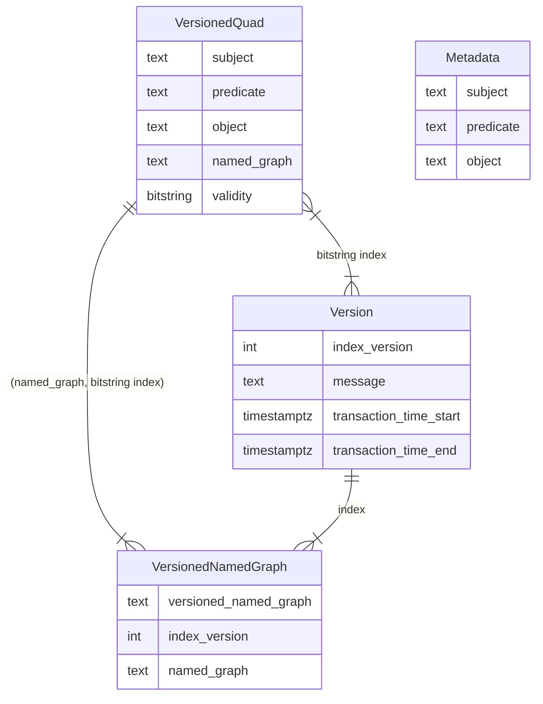
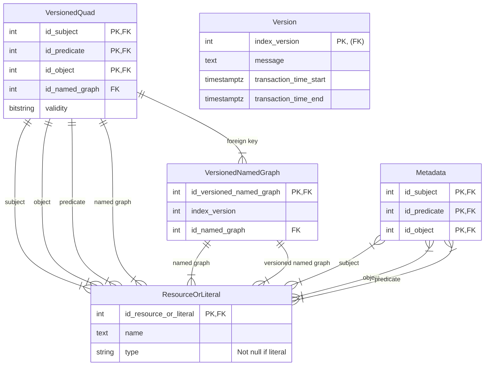
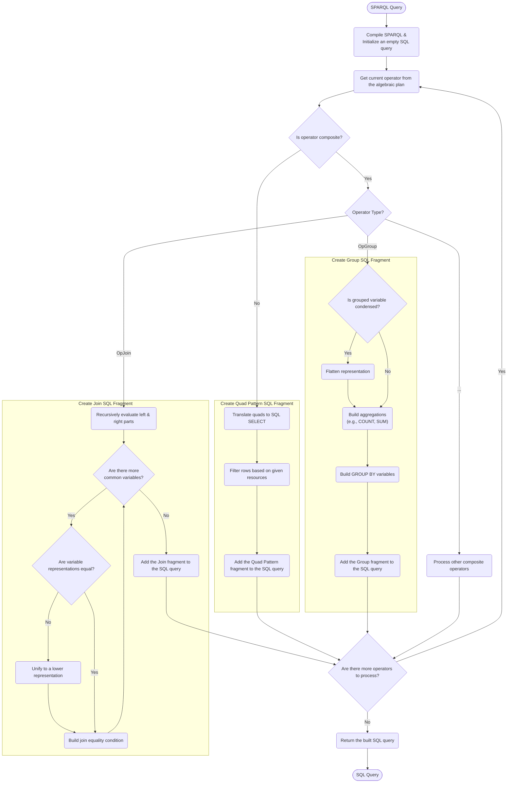
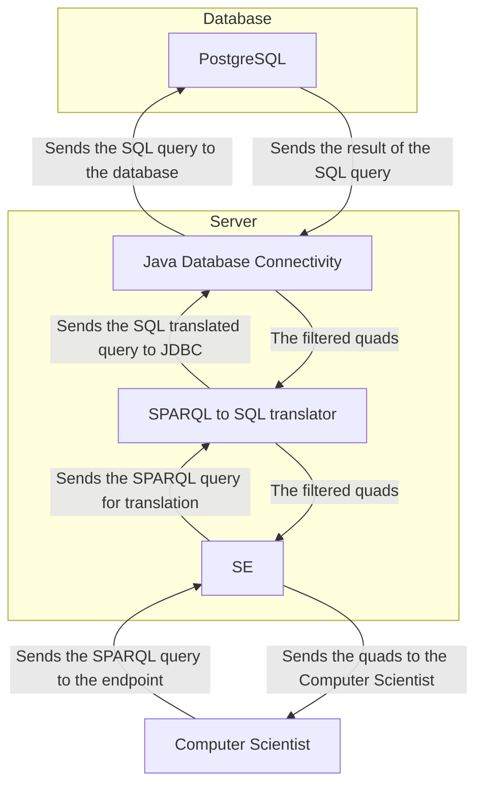
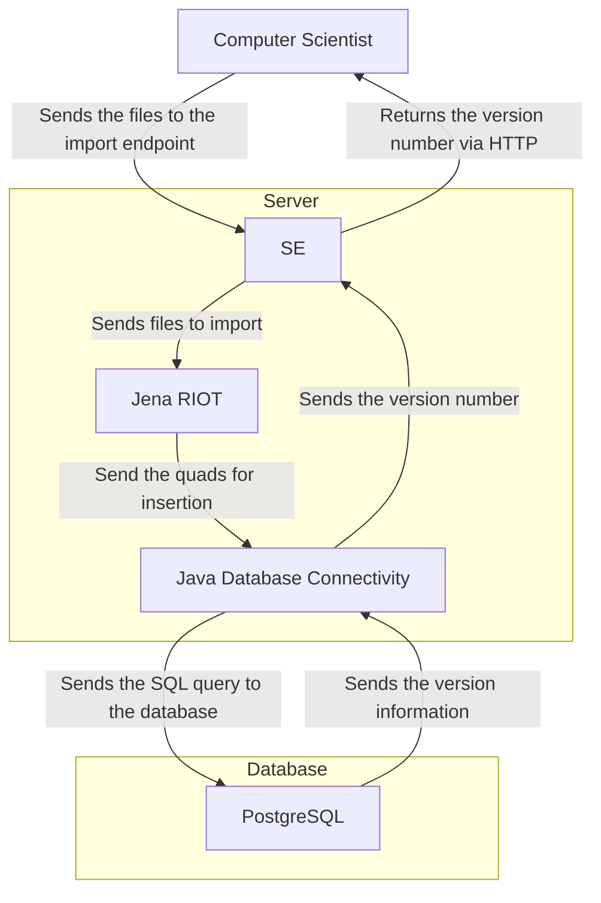
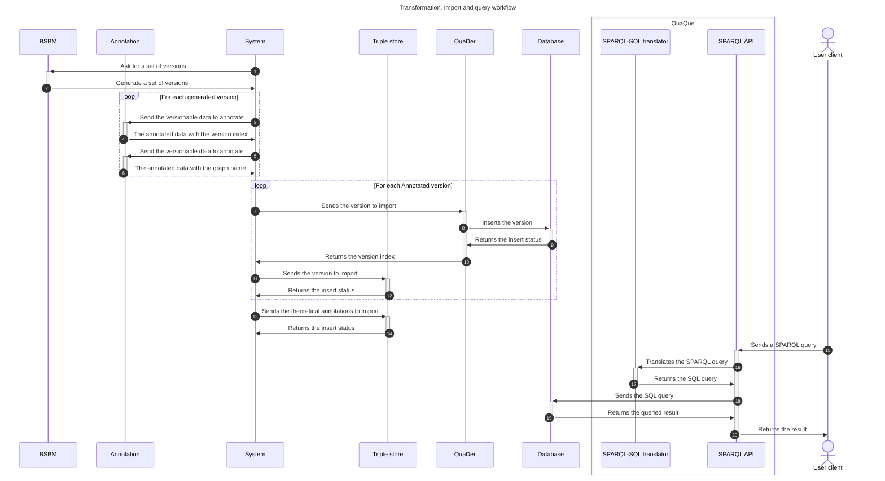

# ConVer-G project

> Which means Concurrent Versioning of knowledge Graphs

This project aims to create a knowledge hub that can store and query a set of RDF datasets with a versioning system.
The project is part of the BD team's research efforts within the [LIRIS](https://liris.cnrs.fr/)
and [VCity project](https://projet.liris.cnrs.fr/vcity/).
The aim of this POC is to query a set of city version and extract associated knowledge.

> This system has a demonstration and its code source is [available on GitHub](https://github.com/VCityTeam/UD-Demo-VCity-Knowledge_Evolution).

## Motivations

### Why create a "SPARQL to SQL" translator rather than a from scratch engine?

Our motivation is to find a method for *retrieving knowledge* from a *set of urban data versions* stored in *RDF
format*.

Motivations for linking SPARQL and SQL are numerous, particularly in the fields of science, technology,
and business, where there is a growing need to integrate increasingly diverse data sources (captors, institutions, ...).
By using a SPARQL to SQL translator, we can enable relational databases to be exposed on the Semantic Web and queried
with SPARQL *(with the same performance as with SQL?)*.
This allows researchers and developers to work with RDF and relational data seamlessly and efficiently while leveraging
the performance optimizations of existing relational databases.

A *"from scratch"* engine that is not based on SPARQL nor SQL *would not be interoperable* with these query systems.
It is more simple than reimplementing the full stack (algebra, including join algorithms, optimisation, efficient
storage and indexing)
and because we think that performance will be comparable to a dedicated implementation.

### Why this experiment?

We want to ensure the **provenance, accuracy, efficiency, and reliability** of querying a condensed representation of
the various version of a dataset with regard to querying each different version represented extensionally,
that is understanding whether our proposal of adding to each quad the set of versions it appears in,
instead of representing each version as a separate dataset, leads to a more efficient way of answering queries across
versions.
A query-scenario of this experiment can be : *"Which city version has the highest number of trees in the district 1?"*

### Notes

Using a SQL as a backend for SPARQL has been done in some cases.

- **[A Mapping of SPARQL Onto Conventional SQL - W3C](https://www.w3.org/2008/07/MappingRules/StemMapping)**
  This paper discusses a semantics for expressing relational data as an RDF graph and an algebra for mapping SPARQL
  SELECT queries over that RDF to SQL queries over the original relational data.
  The goal is to provide a specification for SPARQL tool vendors and a foundation for the Semantic Web. It highlights
  the importance of creating a computable mapping from SPARQL semantics to SQL semantics.
- **[Evaluating SPARQL to SQL Translation in Ontop - Free University of Bozen-Bolzano](https://www.inf.unibz.it/~calvanese/papers/rodr-etal-ORE-2013.pdf)**
  This research paper discusses the importance of mapping relational databases into RDF using the R2RML standard.
  It mentions the research focused on translating SPARQL queries into SQL and evaluates the SPARQL to SQL translation in
  the Ontop system.
- **[RDF and SPARQL: Using Semantic Web Technology to Integrate the World's Data - W3C](https://www.w3.org/2007/03/VLDB/)**
  This resource explains how RDF and SPARQL can be used to improve access to relational databases. It discusses
  techniques for improving mappings between RDF and relational data and mentions that several query engines map SPARQL
  queries to relational queries,
  either by rewriting them into SQL queries or by compiling them directly into evaluation structures native to the
  database.

## Getting started

### Installation

This project uses Java 21 JDK + Maven and
a [dockerized (make sure that Docker is installed too)](https://www.docker.com/) [PostgreSQL 17 database](https://www.postgresql.org/docs/17/index.html).
If you don't have Java 21 installed by default, I recommend that you install [SDKMAN!](https://sdkman.io/) and use this
tool to set Java 21 as current session version.

> SDKMAN! is a tool for managing parallel versions of multiple Software Development Kits on most Unix based systems.

Once you have `SDKMAN!` installed, run:

```shell
sdk install java 21.0.1-amzn
sdk use java 21.0.1-amzn
```

Make sure you have Maven installed. If you don't have Maven installed, run: `sudo apt install maven`.

### Maven

#### ⌛ Quads-Loader

This project:

- uses the `jena-arq` library for parsing SPARQL statements in Java,
- uses the `springdoc-openapi-starter-webmvc-ui` library to parse the Swagger API annotations and displays
  the [swagger-ui](http://localhost:8080/swagger-ui/index.html),
- needs a [PostgreSQL 17 database](https://www.postgresql.org/docs/17/index.html), so the `postgresql` driver is
  installed too.

This project has been tested with:

- `sonarqube`, assuring the code quality,
- `JaCoCo`, testing the code coverage.

#### 🦆 Quads-Query

This project:

- uses the `jena-fuseki-server` Apache Jena Fuseki is a SPARQL server,
- needs a [PostgreSQL 17 database](https://www.postgresql.org/docs/17/index.html) if you use this target language, so
  the `postgresql` driver is
  installed too.

This project has been tested with: `junit-jupiter-engine`

### Start the application

#### ⌛ Quads-Loader

```shell
# at the root of the project
# starts the database declared inside the docker-compose.yml file
docker compose up -d

# if you want to hack the import program
cd quads-loader

## wait until the PostgreSQL database is up
## starts the Java Spring application locally (http://localhost:8080/)
java "-DDATASOURCE_URL=<url>" "-DDATASOURCE_USERNAME=<username>" "-DDATASOURCE_PASSWORD=<password>" -jar target/quads-loader-0.0.1-SNAPSHOT.jar
```

#### 🦆 Quads-Query

```shell
# at the root of the project
# starts the database declared inside the docker-compose.yml file
docker compose up -d

# if you want to hack the import program
cd quads-query

## wait until the PostgreSQL database is up
# build the project
mvn package

## starts the Java Spring application locally (http://localhost:8081/)
java "-DDATASOURCE_URL=<url>" "-DDATASOURCE_USERNAME=<username>" "-DDATASOURCE_PASSWORD=<password>" ?"-DTARGET_LANG=<target language>" ?"-DCONDENSED_MODE=<boolean>" -jar quads-query-1.0-SNAPSHOT-jar-with-dependencies.jar
```

### Implementation

#### Ontology

![The graph versioning ontology](https://www.ldf.fi/service/rdf-grapher?rdf=%40prefix+vers%3A+%3Chttps%3A%2F%2Fgithub.com%2FVCityTeam%2FConVer-G%2F%3E+.%0D%0A%40prefix+rdf%3A+%3Chttp%3A%2F%2Fwww.w3.org%2F1999%2F02%2F22-rdf-syntax-ns%23%3E+.%0D%0A%40prefix+rdfs%3A+%3Chttp%3A%2F%2Fwww.w3.org%2F2000%2F01%2Frdf-schema%23%3E+.%0D%0A%40prefix+purl%3A+%3Chttp%3A%2F%2Fpurl.org%2Fdc%2Felements%2F1.1%3E+.%0D%0A%0D%0A%3Cvers%3AVersioned-Named-Graph%3E+%3Crdf%3Atype%3E+rdfs%3AResource+.%0D%0A%3Cvers%3AVersioned-Named-Graph%3E+%3Crdfs%3Acomment%3E+%22A+versioned+graph+name%22+.%0D%0A%3Cvers%3AVersioned-Named-Graph%3E+%3Crdfs%3Alabel%3E+%22Versioned+named+graph%22%40en+.%0D%0A%3Cvers%3AVersioned-Named-Graph%3E+%3Crdfs%3Alabel%3E+%22Graphe+nomm%C3%A9+versionn%C3%A9%22%40fr+.%0D%0A%0D%0A%3Cvers%3AVersioned-Named-Graph%3E+%3Cvers%3AVersion%23is-in-version%3E+vers%3AVersion+.%0D%0A%3Cvers%3AVersion%3E+%3Crdf%3Atype%3E+rdfs%3AClass+.%0D%0A%3Cvers%3AVersion%3E+%3Crdfs%3Acomment%3E+%22A+dataset+version%22+.%0D%0A%3Cvers%3AVersion%3E+%3Crdfs%3Alabel%3E+%22Version%22%40en+.%0D%0A%3Cvers%3AVersion%3E+%3Crdfs%3Alabel%3E+%22Version%22%40fr+.%0D%0A%0D%0A%3Cvers%3AVersioned-Named-Graph%3E+%3Cvers%3AVersion%23is-version-of%3E+vers%3ANamed-Graph+.%0D%0A%3Cvers%3ANamed-Graph%3E+%3Crdf%3Atype%3E+rdfs%3AClass+.%0D%0A%3Cvers%3ANamed-Graph%3E+%3Crdfs%3Acomment%3E+%22A+graph+name%22+.%0D%0A%3Cvers%3ANamed-Graph%3E+%3Crdfs%3Alabel%3E+%22Named+graph%22%40en+.%0D%0A%3Cvers%3ANamed-Graph%3E+%3Crdfs%3Alabel%3E+%22Graphe+nomm%C3%A9%22%40fr+.%0D%0A%0D%0A%3Cvers%3AVersioning%3E+%3Crdf%3Atype%3E+%3Chttp%3A%2F%2Fwww.w3.org%2F2002%2F07%2Fowl%23Ontology%3E+.%0D%0A%3Cvers%3AVersioning%3E+%3Cpurl%3Atitle%3E+%22The+graph+versioning+vocabulary%22+.%0D%0A%3Cvers%3AVersioning%3E+%3Cpurl%3Adate%3E+%222024-08-26%22+.%0D%0A%3Cvers%3AVersioning%3E+%3Cpurl%3Adescription%3E+%22RDF+schema+of+the+graph+versioning+vocabulary+terms%22+.&from=ttl&to=png)

#### Conceptual model



#### Entity–Relationship model



#### Flowcharts
##### Translation of a SPARQL query to SQL



##### Query the relational database with a SPARQL query



##### Store RDF quads inside a relational database



### Testing

#### Swagger

The API description is available on the [swagger-ui](http://localhost:8080/swagger-ui/index.html) at runtime.

#### Tests

```shell
# make sure your database is up

# starts the tests
mvn spring-boot:run test
```

#### Code quality and coverage

The code coverage and quality is available on the [Sonarqube server](http://localhost:9000) after running a sonar
inspection.

### Sample data and workflow

This project has been tested with a dataset created by the [UD-Graph Project](https://github.com/VCityTeam/UD-Graph).
This dataset as been transformed to be compatible with the designed conceptual model.



The workflows have been moved inside the [UD-knowledge-evolution-experiment](https://github.com/VCityTeam/UD-knowledge-evolution-experiment) repository.

#### Entity linking

Before importing the dataset inside the triple store and the relational database, we transform the data to match the
theoretical model and the implementation.

##### Contextualization

We add a quad for each triple (the graph name).
Its semantic is the link between the triple and the source of the data.
The transformation has been made with the [annotate python program](quads-creator-old/annotate_graph.py).
We used a virtual environment with pip 23.3.1 from Python 3.10.12.

```shell
# create a virtual environment
python3 -m venv venv

# activate the virtual environment
source venv/bin/activate

# install the dependencies
pip install -r python/requirements.txt

# run the program
cd workflows
/bin/bash workflow-bsbm.sh 2 7500 1000 10 > allout.txt 2>&1

# in another terminal
cd workflows
tail -f allout.txt
```

Let's assume that we have a dataset with 2 versions with the following quads:

**Version 1 (buildings-2015.trig):**

| Subject                       | Predicate | Object | Named Graph                               |
|-------------------------------|-----------|--------|-------------------------------------------|
| http://example.edu/Building#1 | height    | 10.5   | http://example.edu/Named-Graph#Grand-Lyon |
| http://example.edu/Building#2 | height    | 9.1    | http://example.edu/Named-Graph#Grand-Lyon |
| http://example.edu/Building#1 | height    | 11     | http://example.edu/Named-Graph#IGN        |

**Version 2 (buildings-2018.trig):**

| Subject                       | Predicate | Object | Named Graph                               |
|-------------------------------|-----------|--------|-------------------------------------------|
| http://example.edu/Building#1 | height    | 10.5   | http://example.edu/Named-Graph#IGN        |
| http://example.edu/Building#1 | height    | 10.5   | http://example.edu/Named-Graph#Grand-Lyon |
| http://example.edu/Building#3 | height    | 15     | http://example.edu/Named-Graph#Grand-Lyon |

##### Theoretical model

After some transformations, we have the following quads representing the theoretical model:

| Subject                                                              | Predicate                                                   | Object                                                       | Named Graph                                                          | 
|----------------------------------------------------------------------|-------------------------------------------------------------|--------------------------------------------------------------|----------------------------------------------------------------------|
| http://example.edu/Building#1                                        | height                                                      | 10.5                                                         | https://github.com/VCityTeam/ConVer-G/Versioned-Named-Graph#sha256-1 |
| http://example.edu/Building#2                                        | height                                                      | 9.1                                                          | https://github.com/VCityTeam/ConVer-G/Versioned-Named-Graph#sha256-1 |
| http://example.edu/Building#1                                        | height                                                      | 11                                                           | https://github.com/VCityTeam/ConVer-G/Versioned-Named-Graph#sha256-2 |
| https://github.com/VCityTeam/ConVer-G/Versioned-Named-Graph#sha256-1 | https://github.com/VCityTeam/ConVer-G/Version#is-version-of | http://example.edu/Named-Graph#Grand-Lyon                    |                                                                      |
| https://github.com/VCityTeam/ConVer-G/Versioned-Named-Graph#sha256-1 | https://github.com/VCityTeam/ConVer-G/Version#is-in-version | https://github.com/VCityTeam/ConVer-G/Version#buildings-2015 |                                                                      |
| https://github.com/VCityTeam/ConVer-G/Versioned-Named-Graph#sha256-2 | https://github.com/VCityTeam/ConVer-G/Version#is-version-of | http://example.edu/Named-Graph#IGN                           |                                                                      |
| https://github.com/VCityTeam/ConVer-G/Versioned-Named-Graph#sha256-2 | https://github.com/VCityTeam/ConVer-G/Version#is-in-version | https://github.com/VCityTeam/ConVer-G/Version#buildings-2015 |                                                                      |
| http://example.edu/Building#1                                        | height                                                      | 10.5                                                         | https://github.com/VCityTeam/ConVer-G/Versioned-Named-Graph#sha256-3 |
| http://example.edu/Building#3                                        | height                                                      | 15                                                           | https://github.com/VCityTeam/ConVer-G/Versioned-Named-Graph#sha256-3 |
| http://example.edu/Building#1                                        | height                                                      | 10.5                                                         | https://github.com/VCityTeam/ConVer-G/Versioned-Named-Graph#sha256-4 |
| https://github.com/VCityTeam/ConVer-G/Versioned-Named-Graph#sha256-3 | https://github.com/VCityTeam/ConVer-G/Version#is-version-of | http://example.edu/Named-Graph#Grand-Lyon                    |                                                                      |
| https://github.com/VCityTeam/ConVer-G/Versioned-Named-Graph#sha256-3 | https://github.com/VCityTeam/ConVer-G/Version#is-in-version | https://github.com/VCityTeam/ConVer-G/Version#buildings-2018 |                                                                      |
| https://github.com/VCityTeam/ConVer-G/Versioned-Named-Graph#sha256-4 | https://github.com/VCityTeam/ConVer-G/Version#is-version-of | http://example.edu/Named-Graph#IGN                           |                                                                      |
| https://github.com/VCityTeam/ConVer-G/Versioned-Named-Graph#sha256-4 | https://github.com/VCityTeam/ConVer-G/Version#is-in-version | https://github.com/VCityTeam/ConVer-G/Version#buildings-2018 |                                                                      |

##### Implementation

After the import inside the relational database, we have the following quads representing the implementation:

| Subject                       | Predicate | Object | Named Graph                               | Validity |
|-------------------------------|-----------|--------|-------------------------------------------|----------|
| http://example.edu/Building#1 | height    | 10.5   | http://example.edu/Named-Graph#Grand-Lyon | 11       |
| http://example.edu/Building#2 | height    | 9.1    | http://example.edu/Named-Graph#Grand-Lyon | 10       |
| http://example.edu/Building#1 | height    | 11     | http://example.edu/Named-Graph#IGN        | 10       |
| http://example.edu/Building#1 | height    | 10.5   | http://example.edu/Named-Graph#IGN        | 01       |
| http://example.edu/Building#3 | height    | 15     | http://example.edu/Named-Graph#Grand-Lyon | 01       |
