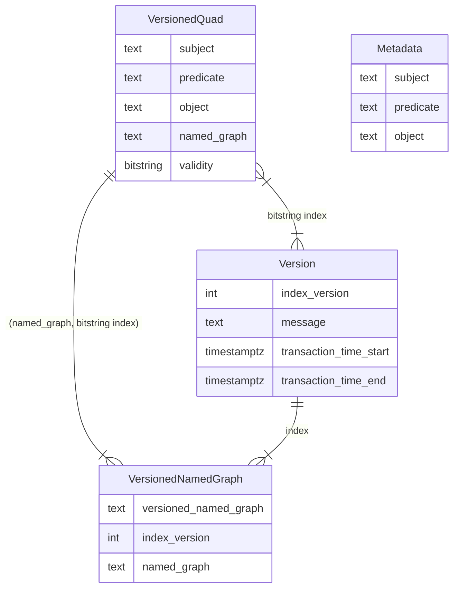
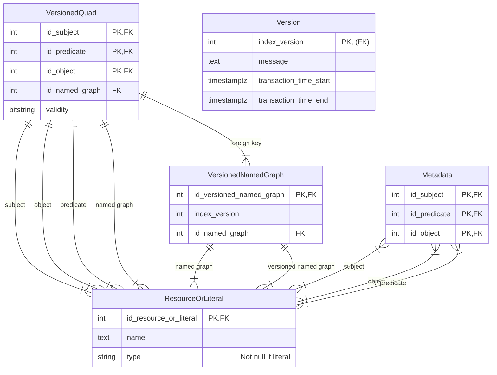
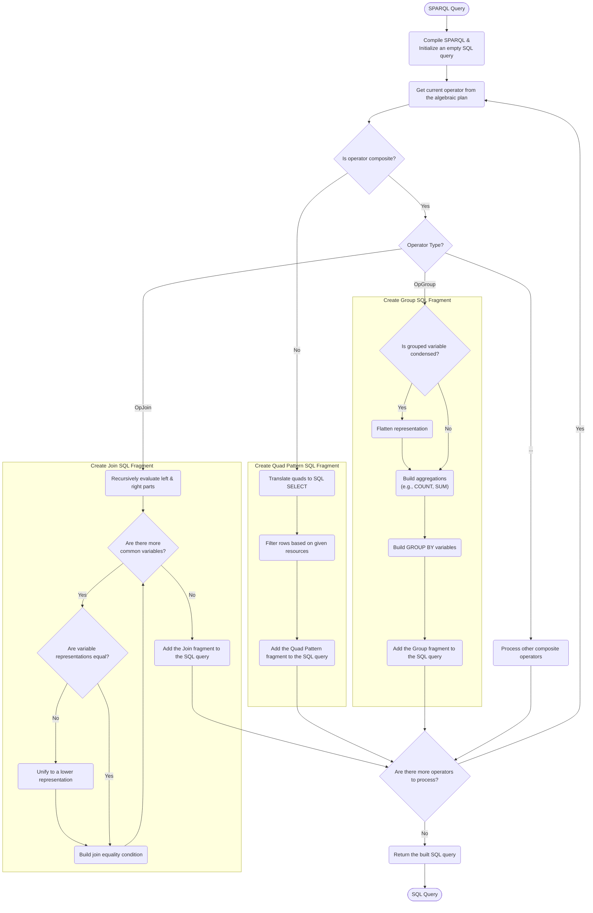
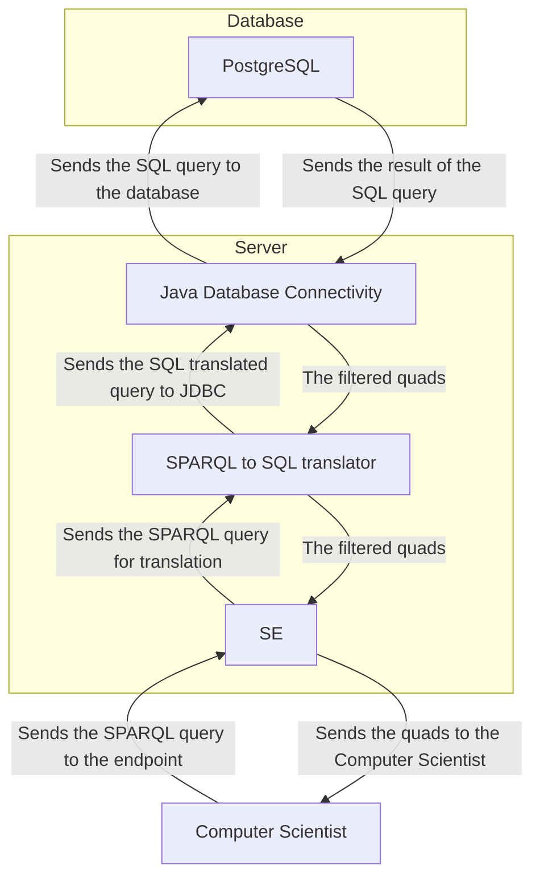
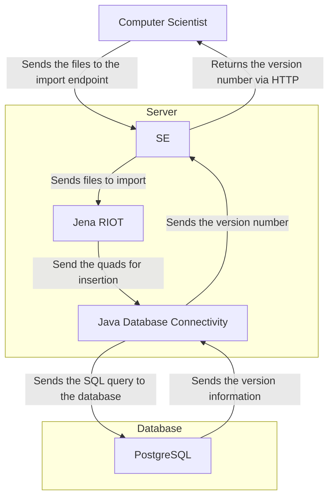

# Architecture

## Ontology

![The graph versioning ontology](https://www.ldf.fi/service/rdf-grapher?rdf=%40prefix+vers%3A+%3Chttps%3A%2F%2Fgithub.com%2FVCityTeam%2FConVer-G%2F%3E+.%0D%0A%40prefix+rdf%3A+%3Chttp%3A%2F%2Fwww.w3.org%2F1999%2F02%2F22-rdf-syntax-ns%23%3E+.%0D%0A%40prefix+rdfs%3A+%3Chttp%3A%2F%2Fwww.w3.org%2F2000%2F01%2Frdf-schema%23%3E+.%0D%0A%40prefix+purl%3A+%3Chttp%3A%2F%2Fpurl.org%2Fdc%2Felements%2F1.1%3E+.%0D%0A%40prefix+prov%3A+%3Chttp%3A%2F%2Fwww.w3.org%2Fns%2Fprov%23%3E+.%0D%0A%0D%0A%3Cvers%3AVersioned-Named-Graph%3E+%3Crdf%3Atype%3E+prov%3AEntity+.%0D%0A%3Cvers%3AVersioned-Named-Graph%3E+%3Crdfs%3Acomment%3E+%22A+versioned+graph+name%22+.%0D%0A%3Cvers%3AVersioned-Named-Graph%3E+%3Crdfs%3Alabel%3E+%22Versioned+named+graph%22%40en+.%0D%0A%3Cvers%3AVersioned-Named-Graph%3E+%3Crdfs%3Alabel%3E+%22Graphe+nomm%C3%A9+versionn%C3%A9%22%40fr+.%0D%0A%0D%0A%3Cvers%3AVersioned-Named-Graph%3E+%3Cprov%3AatLocation%3E+prov%3ALocation+.%0D%0A%0D%0A%3Cvers%3AVersioned-Named-Graph%3E+%3Cprov%3AspecializationOf%3E+vers%3ANamed-Graph+.%0D%0A%3Cvers%3ANamed-Graph%3E+%3Crdf%3Atype%3E+prov%3AEntity+.%0D%0A%3Cvers%3ANamed-Graph%3E+%3Crdfs%3Acomment%3E+%22A+graph+name%22+.%0D%0A%3Cvers%3ANamed-Graph%3E+%3Crdfs%3Alabel%3E+%22Named+graph%22%40en+.%0D%0A%3Cvers%3ANamed-Graph%3E+%3Crdfs%3Alabel%3E+%22Graphe+nomm%C3%A9%22%40fr+.%0D%0A%0D%0A%3Cvers%3AVersioning%3E+%3Crdf%3Atype%3E+%3Chttp%3A%2F%2Fwww.w3.org%2F2002%2F07%2Fowl%23Ontology%3E+.%0D%0A%3Cvers%3AVersioning%3E+%3Cpurl%3Atitle%3E+%22The+graph+versioning+vocabulary%22+.%0D%0A%3Cvers%3AVersioning%3E+%3Cpurl%3Adate%3E+%222024-08-26%22+.%0D%0A%3Cvers%3AVersioning%3E+%3Cpurl%3Adescription%3E+%22RDF+schema+of+the+graph+versioning+vocabulary+terms%22+.&from=ttl&to=png)

## Conceptual model

## Entity–Relationship model

## Flowcharts

### Translation of a SPARQL query to SQL

### Query the relational database with a SPARQL query

### Store RDF quads inside a relational database

