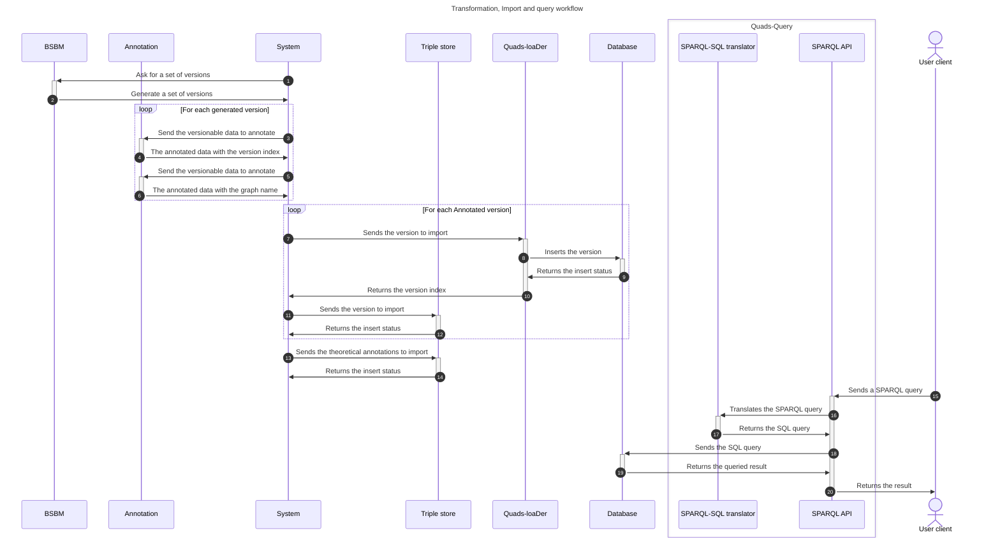

# Sample data and workflow

This project has been tested with a dataset created by the [UD-Graph Project](https://github.com/VCityTeam/UD-Graph).
This dataset as been transformed to be compatible with the designed conceptual model.



The workflows have been moved inside the [UD-knowledge-evolution-experiment](https://github.com/VCityTeam/UD-knowledge-evolution-experiment) repository.

## Entity linking

Before importing the dataset inside the triple store and the relational database, we transform the data to match the
theoretical model and the implementation.

### Contextualization

We add a quad for each triple (the graph name).
Its semantic is the link between the triple and the source of the data.
The transformation has been made with the [annotate program](../quads-creator).
Let's assume that we have a dataset with 2 versions with the following quads:

**Version 1 (buildings-2015.trig):**

| Subject                       | Predicate | Object | Named Graph                               |
| ----------------------------- | --------- | ------ | ----------------------------------------- |
| http://example.edu/Building#1 | height    | 10.5   | http://example.edu/Named-Graph#Grand-Lyon |
| http://example.edu/Building#2 | height    | 9.1    | http://example.edu/Named-Graph#Grand-Lyon |
| http://example.edu/Building#1 | height    | 11     | http://example.edu/Named-Graph#IGN        |

**Version 2 (buildings-2018.trig):**

| Subject                       | Predicate | Object | Named Graph                               |
| ----------------------------- | --------- | ------ | ----------------------------------------- |
| http://example.edu/Building#1 | height    | 10.5   | http://example.edu/Named-Graph#IGN        |
| http://example.edu/Building#1 | height    | 10.5   | http://example.edu/Named-Graph#Grand-Lyon |
| http://example.edu/Building#3 | height    | 15     | http://example.edu/Named-Graph#Grand-Lyon |

### Theoretical model

After some transformations, we have the following quads representing the theoretical model:

| Subject                                                              | Predicate                                  | Object                                    | Named Graph                                                          |
| -------------------------------------------------------------------- | ------------------------------------------ | ----------------------------------------- | -------------------------------------------------------------------- |
| http://example.edu/Building#1                                        | height                                     | 10.5                                      | https://github.com/VCityTeam/ConVer-G/Versioned-Named-Graph#sha256-1 |
| http://example.edu/Building#2                                        | height                                     | 9.1                                       | https://github.com/VCityTeam/ConVer-G/Versioned-Named-Graph#sha256-1 |
| http://example.edu/Building#1                                        | height                                     | 11                                        | https://github.com/VCityTeam/ConVer-G/Versioned-Named-Graph#sha256-2 |
| https://github.com/VCityTeam/ConVer-G/Versioned-Named-Graph#sha256-1 | http://www.w3.org/ns/prov#specializationOf | http://example.edu/Named-Graph#Grand-Lyon |                                                                      |
| https://github.com/VCityTeam/ConVer-G/Versioned-Named-Graph#sha256-1 | http://www.w3.org/ns/prov#atLocation       | buildings-2015                            |                                                                      |
| https://github.com/VCityTeam/ConVer-G/Versioned-Named-Graph#sha256-2 | http://www.w3.org/ns/prov#specializationOf | http://example.edu/Named-Graph#IGN        |                                                                      |
| https://github.com/VCityTeam/ConVer-G/Versioned-Named-Graph#sha256-2 | http://www.w3.org/ns/prov#atLocation       | buildings-2015                            |                                                                      |
| http://example.edu/Building#1                                        | height                                     | 10.5                                      | https://github.com/VCityTeam/ConVer-G/Versioned-Named-Graph#sha256-3 |
| http://example.edu/Building#3                                        | height                                     | 15                                        | https://github.com/VCityTeam/ConVer-G/Versioned-Named-Graph#sha256-3 |
| http://example.edu/Building#1                                        | height                                     | 10.5                                      | https://github.com/VCityTeam/ConVer-G/Versioned-Named-Graph#sha256-4 |
| https://github.com/VCityTeam/ConVer-G/Versioned-Named-Graph#sha256-3 | http://www.w3.org/ns/prov#specializationOf | http://example.edu/Named-Graph#Grand-Lyon |                                                                      |
| https://github.com/VCityTeam/ConVer-G/Versioned-Named-Graph#sha256-3 | http://www.w3.org/ns/prov#atLocation       | buildings-2018                            |                                                                      |
| https://github.com/VCityTeam/ConVer-G/Versioned-Named-Graph#sha256-4 | http://www.w3.org/ns/prov#specializationOf | http://example.edu/Named-Graph#IGN        |                                                                      |
| https://github.com/VCityTeam/ConVer-G/Versioned-Named-Graph#sha256-4 | http://www.w3.org/ns/prov#atLocation       | buildings-2018                            |                                                                      |

### Implementation

After the import inside the relational database, we have the following quads representing the implementation:

| Subject                       | Predicate | Object | Named Graph                               | Validity |
| ----------------------------- | --------- | ------ | ----------------------------------------- | -------- |
| http://example.edu/Building#1 | height    | 10.5   | http://example.edu/Named-Graph#Grand-Lyon | 11       |
| http://example.edu/Building#2 | height    | 9.1    | http://example.edu/Named-Graph#Grand-Lyon | 10       |
| http://example.edu/Building#1 | height    | 11     | http://example.edu/Named-Graph#IGN        | 10       |
| http://example.edu/Building#1 | height    | 10.5   | http://example.edu/Named-Graph#IGN        | 01       |
| http://example.edu/Building#3 | height    | 15     | http://example.edu/Named-Graph#Grand-Lyon | 01       |

### Example query and expected result

Using the two-version sample dataset above, the following SPARQL query asks for
every building whose `height` is greater than `12`, across all versioned named
graphs:

```sparql
SELECT ?vg ?building ?height WHERE {
    GRAPH ?vg {
      ?building <height> ?height .
      FILTER(?height > 12)
    }
}
```

Only `Building#3` (height `15`) satisfies the filter, and it appears solely in
the `buildings-2018` snapshot of the `Grand-Lyon` named graph
(`Versioned-Named-Graph#sha256-3`, validity `01`). The expected result is
therefore a single row:

| ?vg                                                                  | ?building                     | ?height |
| -------------------------------------------------------------------- | ----------------------------- | ------- |
| https://github.com/VCityTeam/ConVer-G/Versioned-Named-Graph#sha256-3 | http://example.edu/Building#3 | 15      |

A larger, runnable set of example queries together with the data needed to
reproduce them end-to-end is provided in the
[reproducibility guide](https://github.com/VCityTeam/UD-Demo-VCity-Knowledge_Evolution/blob/JOSS-ConVer-G/Reproducibility.md),
and the queries themselves live under [versioned-queries/](../versioned-queries).
