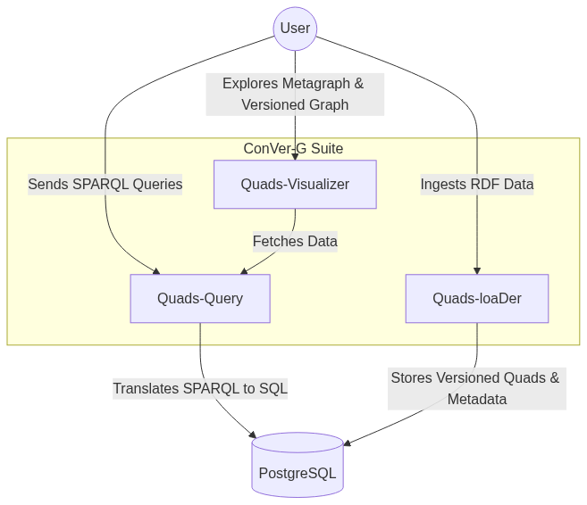
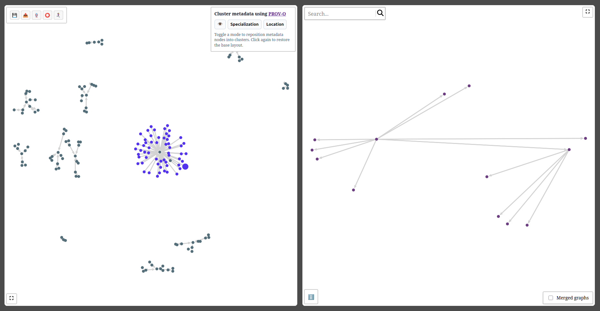
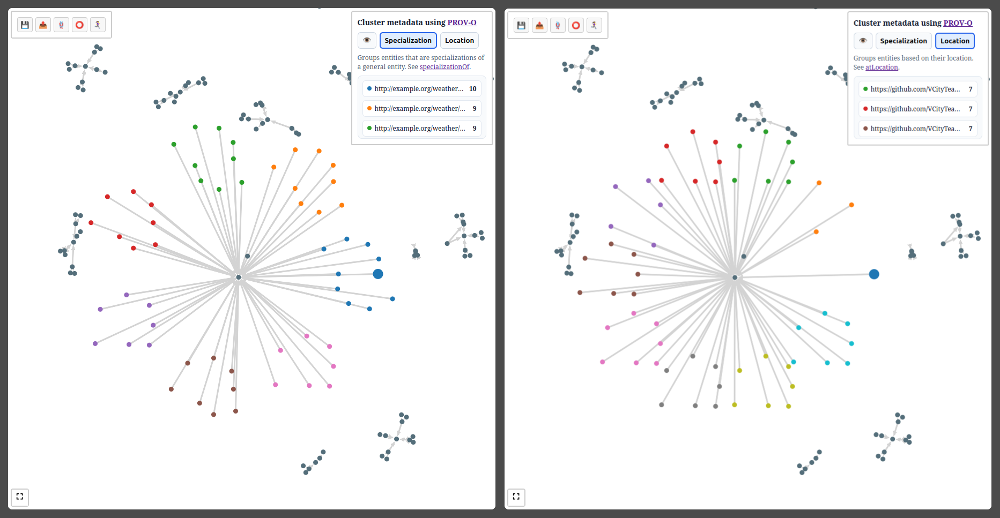
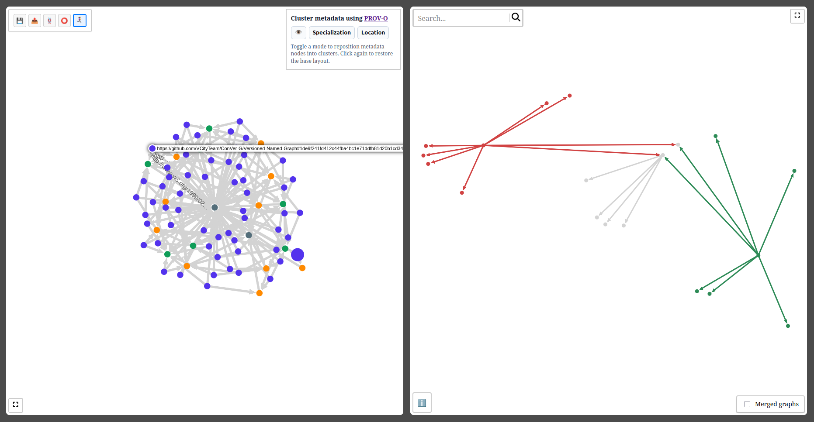
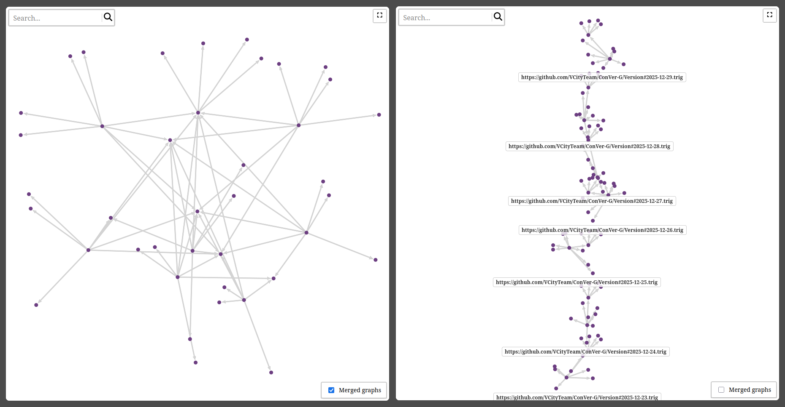

# Summary

Knowledge Graphs (KGs) are dynamic artifacts that evolve continuously as data is updated, corrected, and expanded.
Managing this evolution through explicit versioning is essential to support reproducibility, auditability, provenance tracking, and temporal analysis.
ConVer-G (Concurrent Versioning of Knowledge Graphs) is a software suite designed to address these challenges by providing snapshot-based version management for RDF datasets [@gil2024convergconcurrentversioningknowledge].

The suite is composed of three modular and interoperable components:

1. **Quads-loaDer:** A command-line interface and service for ingesting RDF data, and storing versioned quads efficiently.
2. **Quads-Query:** A query translation engine that converts SPARQL queries into SQL, enabling the interrogation of specific graph versions as well as cross-snapshot and temporal analyses directly over a relational backend.
3. **Quads-Visualizer:** A web-based visualization tool that allows users to explore both the metagraph—capturing the structural history of versions, branches, and their ancestry—and the versioned graph, which represents the RDF quads contained in a selected snapshot.

Together, these components implement a condensed snapshot-based representation of RDF graphs that optimizes storage by sharing common quads across versions, while simultaneously supporting concurrent workflows such as branching and merging.

# Statement of need

The management of evolving RDF data presents significant challenges regarding storage efficiency and query performance.
Traditional approaches often rely on independent snapshots, which lead to massive data redundancy, or simple change logs (deltas), which can degrade query performance as the history grows.

We consider weather forecasting as a use case to demonstrate these needs because it inherently involves data that evolves along multiple dimensions.
Predictions for a target date are updated daily, and different agencies produce competing forecasts.
Effectively managing this requires a system capable of handling non-linear histories where users can query a specific forecast version or compare diverging predictions.

Although several RDF versioning solutions have been proposed—such as SemVersion **SemVersion** [@volkel2005semversion], **R&WBase** [@vander2013r], **R43ples** [@graube2014r43ples], and **OSTRICH** [@taelman2018ostrich]—there remains a clear need for systems that support concurrent versioning, i.e., non-linear histories with branching and merging, while benefiting from the robustness, scalability, and maturity of standard relational database management systems (RDBMS).

Furthermore, translating SPARQL, the standard query language for RDF, into SQL for versioned contexts remains a complex task [@prud2009mapping].
**ConVer-G** addresses these needs by providing an architecture where the **Quads-loaDer** handles the provenance of quads (handling named graphs and snapshots), and **Quads-Query** provides a transparent SPARQL endpoint that translates queries into optimized SQL, leveraging the storage capabilities of PostgreSQL.
This approach allows users to perform snapshot-based queries and analyze the lineage of data, modeled using PROV-O concepts [@provo], without the need for specialized, experimental triple stores.

# Contributions

The software suite contributes three distinct but interoperable tools that operationalize the theoretical framework of concurrent KG versioning.
The architecture is designed to be modular, allowing each component to be used independently or in combination, depending on user needs.
The overall architecture is illustrated in Figure \autoref{fig:architecture}.

{ width=75% }

### Quads-loaDer

The **Quads-loaDer** is the ingestion engine of the suite.
It is responsible for mapping standard RDF serialization formats (Turtle, TriG, N-Quads) into the internal relational schema.
Its primary goals are:

* **Metadata Management:** It manages the metadata associated with provenance, effectively building the "Versioned Named Graph."
* **Storage Optimization:** It condenses storage by identifying and storing the quads by managing a bitmask that indicates the presence of each quad across different snapshots.

### Quads-Query

**Quads-Query** acts as the middleware layer.
It exposes a SPARQL endpoint compatible with standard clients (e.g., Yasgui, Jena).
Its core contribution is the **SPARQL-to-SQL translator**.
Unlike direct mapping approaches[@rodriguez2013evaluating], Quads-Query injects versioning constraints into the SQL generation process.
It allows users to execute queries against a specific snapshot or named branch, dynamically rewriting the query to filter quads valid at that specific point in the version tree.

### Quads-Visualizer

**Quads-Visualizer** is a React-based frontend application designed to visualize the metagraph: the metadata of the versioned KG.
While the backend manages the data, Quads-Visualizer renders two graphs:

- the **Metagraph**—a graph where nodes represent versions (snapshot) and edges represent derivation (parent-child relationships)
- the **Versioned Graph**—a view of the RDF quads present in a selected snapshot.

The clustering feature organizes Versioned Named Graph (VNG) nodes using two PROV-O predicates: `prov:specializationOf` links each VNG node to its *graph name*, grouping all temporal versions of the same named graph; `prov:atLocation` links each VNG node to its *version identifier*, grouping all named graphs captured within the same snapshot.
This clustering enables users to navigate either by structure—observing how a single named graph evolves—or by time—inspecting the complete dataset state at a specific version.

When users find the visualization cluttered by numerous metadata triples, they can toggle the **Focus mode**.
This feature hides all metadata except the PROV-O related triples, allowing users to concentrate on the actual data and its provenance annotations without visual noise.

To enhance comprehension through topology, the tool computes a static position for every node across all versions of all quads, ensuring a consistent structural layout regardless of the version being viewed.
Additionally, the **Change versioned graph** facilitates evolution analysis by computing and displaying the delta between the currently selected Versioned Graph and any other version, allowing administrators and users to visually inspect changes, annotate versions, and understand the derivation history.
This feature also handles selecting a version or a named graph: displaying respectively only the versioned graphs inside the version or the versioned graphs inside the named graph.

The **Merged graphs** option allows users to visualize all versioned graphs merged into a single graph.
When the merged graph mode is disabled, a list of versioned graphs is displayed, allowing users to select and view individual graphs.
A search bar is provided to filter nodes by their labels, facilitating navigation in large datasets with many versioned graphs.

## Reproducibility

A fully reproducible experiment demonstrating the ConVer-G suite is available in the [UD-Demo-VCity-Knowledge_Evolution repository](https://github.com/VCityTeam/UD-Demo-VCity-Knowledge_Evolution/blob/JOSS-ConVer-G/Reproducibility.md).
The experiment uses a weather forecasting use case where the system ingests daily weather predictions from multiple sources, stores them as versioned RDF graphs, and enables snapshots analysis to compare forecast accuracy.
The demonstration requires only Docker and Docker Compose, and includes pre-configured services for all three ConVer-G components along with example SPARQL queries.

# Acknowledgements

This work was supported by the LIRIS laboratory (Laboratoire d'InfoRmatique en Image et Systèmes d'information) and funded in part by the IADoc@UdL program.
We acknowledge the contributions of the VCity project members for the initial urban data use cases that motivated this research.

# References
