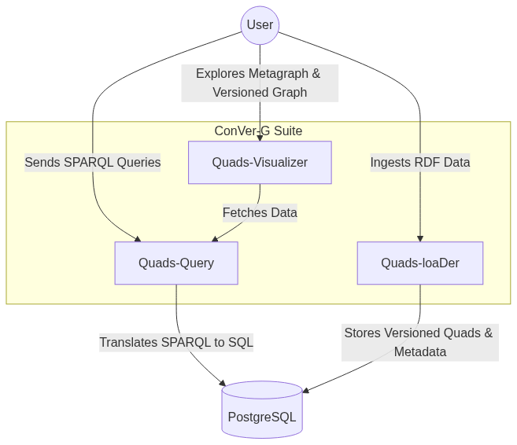
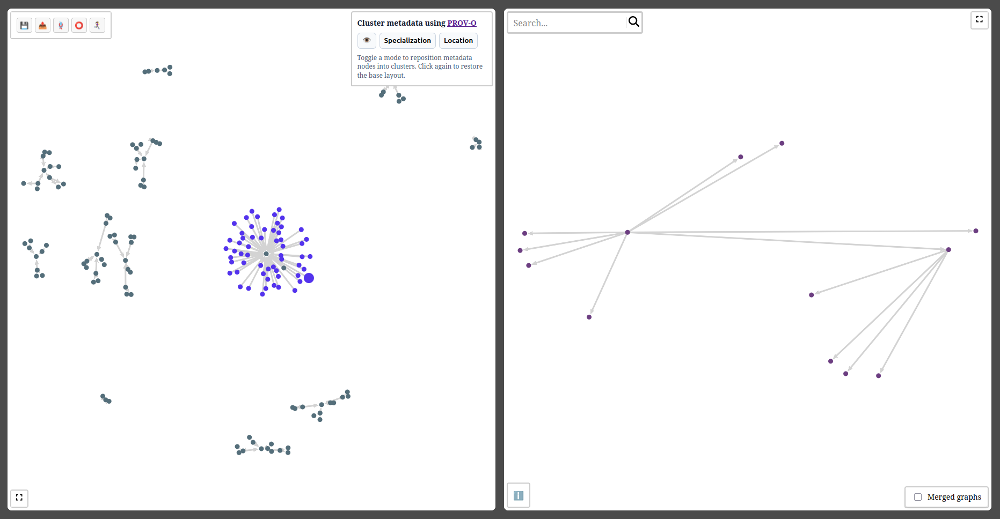
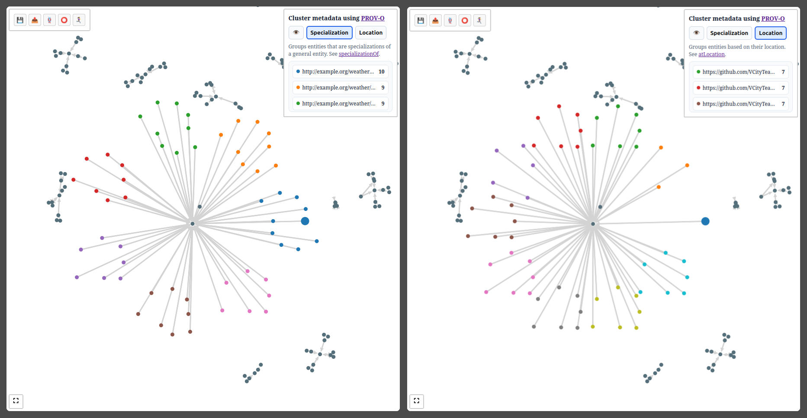
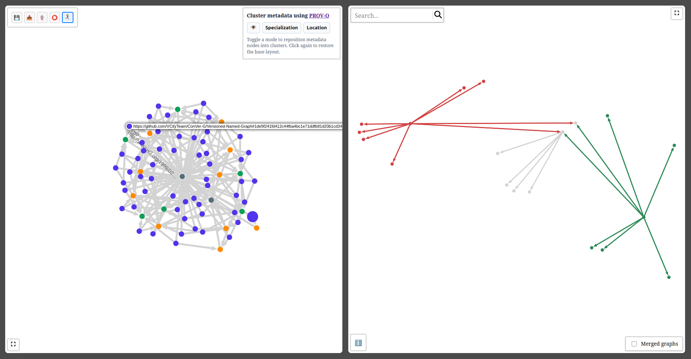
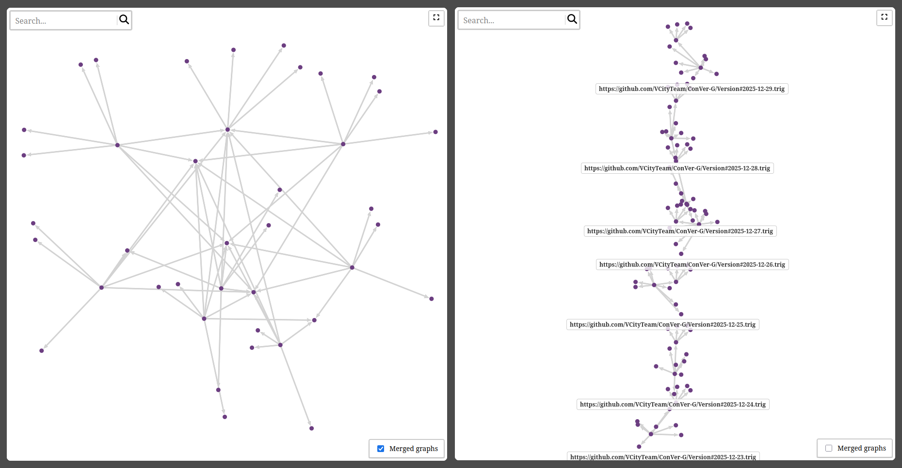

# Summary

A Knowledge Graph (KG) is a structured representation of facts where entities are connected by typed relationships, typically encoded using the Resource Description Framework (RDF) standard.
KGs are widely used across domains such as life sciences, urban planning, and weather forecasting, but evolve continuously as data is updated, corrected, and expanded.
Managing this evolution through explicit *versioning*—much like Git does for source code—is essential for reproducibility, auditability, provenance tracking, and temporal analysis.

ConVer-G (Concurrent Versioning of Knowledge Graphs) is a software suite designed to address these challenges by providing snapshot-based version management for RDF datasets [@gil2024convergconcurrentversioningknowledge].
It allows users to ingest successive states of an RDF dataset, query any past version using the standard SPARQL query language, compare versions, and visually inspect how the graph and its history evolve.
The suite is composed of three modular and interoperable components:

1. **Quads-loaDer:** A command-line interface and service for ingesting RDF data, and storing versioned quads efficiently.
2. **Quads-Query:** A query translation engine that converts SPARQL queries into SQL, enabling the interrogation of specific graph versions as well as cross-snapshot and temporal analyses directly over a relational backend.
3. **Quads-Visualizer:** A web-based visualization tool that allows users to explore both the metagraph—capturing the structural history of versions, branches, and their ancestry—and the versioned graph, which represents the RDF quads contained in a selected snapshot.

Together, these components implement a condensed snapshot-based representation of RDF graphs that optimizes storage by sharing common quads across versions, while simultaneously supporting concurrent workflows such as branching and merging.

# Statement of need

Managing evolving RDF data presents challenges in storage efficiency and query performance.
Traditional approaches rely on independent snapshots, which cause data redundancy, or change logs (deltas), which degrade query performance as history grows.

Weather forecasting illustrates these needs: predictions for a target date are updated daily and different agencies produce competing forecasts, requiring a system that handles non-linear histories where users can query a specific forecast version or compare diverging predictions.

Although several RDF versioning solutions have been proposed—such as SemVersion **SemVersion** [@volkel2005semversion], **R&WBase** [@vander2013r], **R43ples** [@graube2014r43ples], and **OSTRICH** [@taelman2018ostrich]—there remains a clear need for systems that support concurrent versioning, i.e., non-linear histories with branching and merging, while benefiting from the robustness, scalability, and maturity of standard relational database management systems (RDBMS).

Furthermore, translating SPARQL, the standard query language for RDF, into SQL for versioned contexts remains a complex task [@prud2009mapping].
**ConVer-G** addresses these needs by providing an architecture where the **Quads-loaDer** handles the provenance of quads (handling named graphs and snapshots), and **Quads-Query** provides a transparent SPARQL endpoint that translates queries into optimized SQL, leveraging the storage capabilities of PostgreSQL.
This approach allows users to perform snapshot-based queries and analyze the lineage of data, modeled using PROV-O concepts [@provo], without the need for specialized, experimental triple stores.

# State of the field

Existing approaches to RDF versioning generally fall into four categories.
*Independent-copy* (full snapshot) strategies store each revision in full, providing fast version-specific queries at the cost of significant data redundancy.
*Change-based* (delta) strategies, such as those underpinning **R43ples** [@graube2014r43ples], record only the differences between revisions, which is space-efficient but degrades query performance as histories grow because reconstructing a state requires composing many deltas.
*Timestamp-based* approaches, like **Dydra** [@thompson2011dydra], that associates each RDF triple with a timestamp or a validity interval, indicating the period during which it belongs to the knowledge graph.
*Hybrid* strategies, exemplified by **OSTRICH** [@taelman2018ostrich], combine snapshots and deltas to balance storage and query performance, but they rely on dedicated triple-store engines whose operational maturity, indexing, and ecosystem tooling differ from mainstream RDBMS.
Earlier systems such as **SemVersion** [@volkel2005semversion] and **R&WBase** [@vander2013r] introduced versioning concepts (including branching) for RDF, but were not designed around a relational backend nor around an explicit metagraph that captures non-linear histories with branching and merging at the level of named graphs and snapshots.

ConVer-G is positioned within this landscape as a *condensed snapshot* approach realized on top of a standard RDBMS (PostgreSQL).
By materializing quads once and using a bitmask to record their presence across snapshots, it avoids the redundancy of independent copies while preserving the query simplicity of a snapshot model.
The suite distinguishes itself in three ways: (i) it explicitly models concurrent (non-linear) version histories with branching and merging; (ii) it exposes a standard SPARQL endpoint backed by a SPARQL-to-SQL translator that injects versioning constraints into query rewriting, enabling snapshot-specific and cross-snapshot analyses; and (iii) it provides interactive visualization of both the metagraph and the versioned graph, which is, to our knowledge, not jointly available in the systems cited above.

# Software design

The software suite contributes three interoperable tools that operationalize the theoretical framework of concurrent KG versioning.
We chose PostgreSQL over a triple store because it provides mature transactional guarantees, indexing strategies, and operational tooling, at the cost of translating SPARQL into SQL and encoding the versioning model relationally.
For storage, we adopted a *condensed snapshot* representation—each quad is materialized once and a bitmask records its presence across snapshots—balancing storage efficiency with snapshot-query simplicity, avoiding both the redundancy of independent copies and the query cost of pure deltas.
The architecture is modular, allowing each component to be used independently or in combination, as illustrated in Figure \autoref{fig:architecture}.

{ width=75% }

## Quads-loaDer

The **Quads-loaDer** is the ingestion engine of the suite.
It is responsible for mapping standard RDF serialization formats (Turtle, TriG, N-Quads) into the internal relational schema.
Its primary goals are:

* **Metadata Management:** It manages the metadata associated with provenance, effectively building the "Versioned Named Graph."
* **Storage Optimization:** It condenses storage by identifying and storing the quads by managing a bitmask that indicates the presence of each quad across different snapshots.

## Quads-Query

**Quads-Query** acts as the middleware layer.
It exposes a SPARQL endpoint compatible with standard clients (e.g., Yasgui, Jena).
Its core contribution is the **SPARQL-to-SQL translator**.
Unlike direct mapping approaches[@rodriguez2013evaluating], Quads-Query injects versioning constraints into the SQL generation process.
It allows users to execute queries against a specific snapshot or named branch, dynamically rewriting the query to filter quads valid at that specific point in the version tree.

## Quads-Visualizer

**Quads-Visualizer** is a React-based frontend application designed to visualize the metagraph: the metadata of the versioned KG.
While the backend manages the data, Quads-Visualizer renders two graphs:

- the **Metagraph**—a graph where nodes represent versions (snapshot) and edges represent derivation (parent-child relationships)
- the **Versioned Graph**—a view of the RDF quads present in a selected snapshot.

A clustering feature organizes Versioned Named Graph (VNG) nodes using two PROV-O predicates: `prov:specializationOf` groups all temporal versions of the same named graph, while `prov:atLocation` groups all named graphs captured within the same snapshot.
Users can therefore navigate either by structure—observing how a single named graph evolves—or by time—inspecting the complete dataset state at a specific version.
A **Focus mode** further hides non-PROV-O metadata triples to reduce visual noise.

To support comparison, the tool computes a static layout shared across all versions, and a **Change versioned graph** view displays the delta between the currently selected version and any other version.
A **Merged graphs** option allows users to visualize all versioned graphs merged into a single graph, with a search bar to filter nodes by label for navigation in large datasets.

# Research impact statement

ConVer-G targets researchers and practitioners working with evolving RDF datasets who need to manage history explicitly rather than through ad-hoc copies or external scripts.
By building concurrent versioning over a RDBMS and exposing a standard SPARQL endpoint, the suite lowers the entry cost for adopting versioned KGs in projects relying on relational infrastructure, and makes them usable from existing SPARQL clients without modification.

The architectural and theoretical foundations have been published [@gil2024convergconcurrentversioningknowledge], and the software is used within the VCity project at the LIRIS laboratory, where evolving urban and geospatial datasets motivate explicit, branch-aware versioning.
A fully reproducible end-to-end experiment in the [UD-Demo-VCity-Knowledge_Evolution repository](https://github.com/VCityTeam/UD-Demo-VCity-Knowledge_Evolution/blob/JOSS-ConVer-G/Reproducibility.md) ingests daily weather predictions from multiple sources, stores them as versioned RDF graphs, and runs snapshot-based SPARQL queries to compare forecast accuracy.
It requires only Docker and Docker Compose, with pre-configured services for all three components and example SPARQL queries.
Beyond VCity, by showing that concurrent RDF versioning can be built on PostgreSQL with competitive functionality, ConVer-G contributes a reusable architectural template for the semantic web and RDBMS communities, and a teaching artifact for courses on KGs, data versioning, and SPARQL-to-SQL translation.

# AI usage disclosure

AI tools were used for language refinement and formatting only.
All technical content—system design, SPARQL-to-SQL translation, visualization features, experiments, and citations—was conceived, implemented, verified, and authored by the human authors, who take full responsibility for the manuscript and software.
No AI was used to generate results, unreviewed source code, or citations; every reference was checked by the authors.

# Acknowledgements

This work was supported by the LIRIS laboratory (Laboratoire d'InfoRmatique en Image et Systèmes d'information) and funded in part by the IADoc@UdL program.
We acknowledge the contributions of the VCity project members for the initial urban data use cases that motivated this research.

# References
